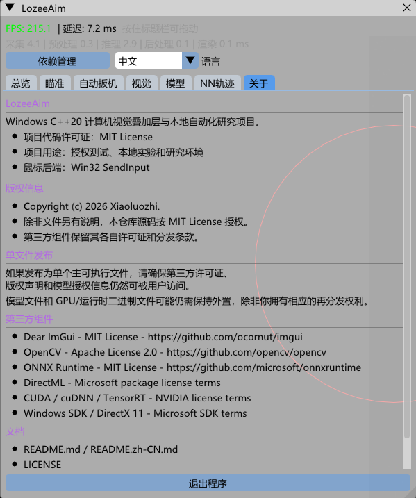

# LozeeAim

Language: English | [简体中文](README.zh-CN.md)

LozeeAim is a Windows C++20 computer-vision overlay and local automation research project. This repository is intended for authorized testing, local experiments, and learning-oriented engineering work.

## Scope

This repository includes the Win32 `SendInput` mouse backend.

The repository does not include model weights, runtime DLLs, or TensorRT engine caches.

## Features

- DirectX 11 transparent overlay with ImGui UI.
- DXGI desktop capture pipeline.
- ONNX Runtime inference with DirectML, CPU, and optional TensorRT support.
- YOLO model hot-reload support.
- Target selection, target prediction, and configurable aim smoothing algorithms.
- NN trajectory data collection, training, ONNX export, and test overlay.
- Chinese and English UI language options.

## Screenshot



## Requirements

- Windows 10/11 x64.
- Visual Studio 2022 or newer with MSVC C++20 tooling.
- Windows SDK.
- OpenCV 4.12.x.
- ONNX Runtime 1.23.x or compatible.
- Optional: CUDA, cuDNN, and TensorRT for TensorRT inference.

## Build configuration

The Visual Studio project reads these environment variables:

```text
OPENCV_ROOT=C:\path\to\opencv
ONNXRUNTIME_ROOT=C:\path\to\onnxruntime
TENSORRT_ROOT=C:\path\to\TensorRT
CUDA_PATH=C:\Program Files\NVIDIA GPU Computing Toolkit\CUDA\v12.x
```

Then build:

```powershell
msbuild LozeeAim.slnx /p:Configuration=Release /p:Platform=x64
```

Runtime DLLs are not committed. Use the dependency manager inside the app or place required runtime files beside the executable according to each dependency license.

## Single-executable distribution

A single-executable package should keep third-party license terms explicit. The application can be distributed as one main executable, but model files and GPU/runtime binaries may still need to remain external unless you have redistribution rights and a bundling path that preserves notices.

If you embed or extract runtime files at startup, keep `THIRD_PARTY_NOTICES.md` available to users and do not hide dependency licenses inside the binary.

## Models

Place YOLO ONNX models under:

```text
models\yolo\
```

Place NN trajectory models under:

```text
models\nn\
```

Model files are intentionally ignored by Git.

## Responsible use

Only use this project in environments where you have explicit authorization. The maintainers do not provide support for misuse, evasion, or unauthorized deployment.

## License

The project code in this repository is licensed under the MIT License unless a file states otherwise. Third-party components keep their own licenses. See `THIRD_PARTY_NOTICES.md`.

